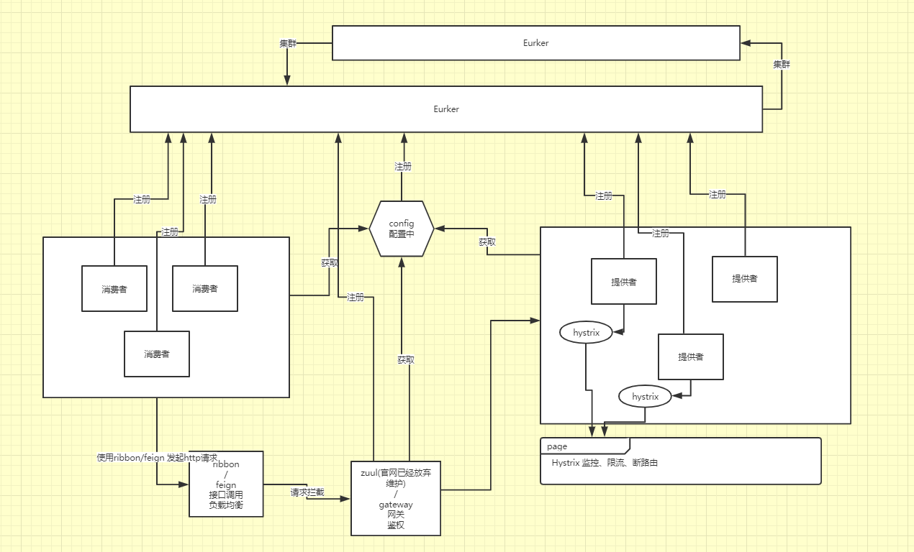

# my-springCloud(Finchley.RELEASE版)

## 一、文件介绍

服务接口提供方：client-eureka-provider-x

服务接口消费方(feign推荐)：client-feign-consumer-x

服务接口消费方(ribbon)：client-ribbon-consumer-x

服务公共配置：server-config-master

注册服务中集群server-eureka-master、server-eureka-slavex

服务网关(gateway推荐)：server-gateway-master

服务网关(zuul)：server-zuul-master

数据库访问采用：jpa

## 二、结构图

